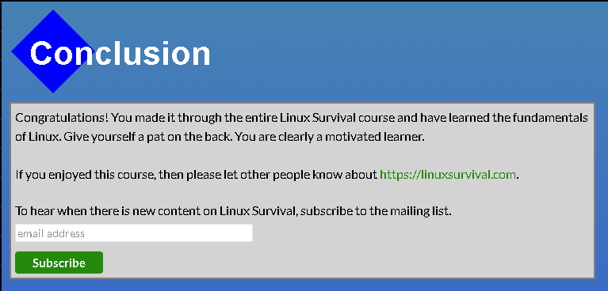
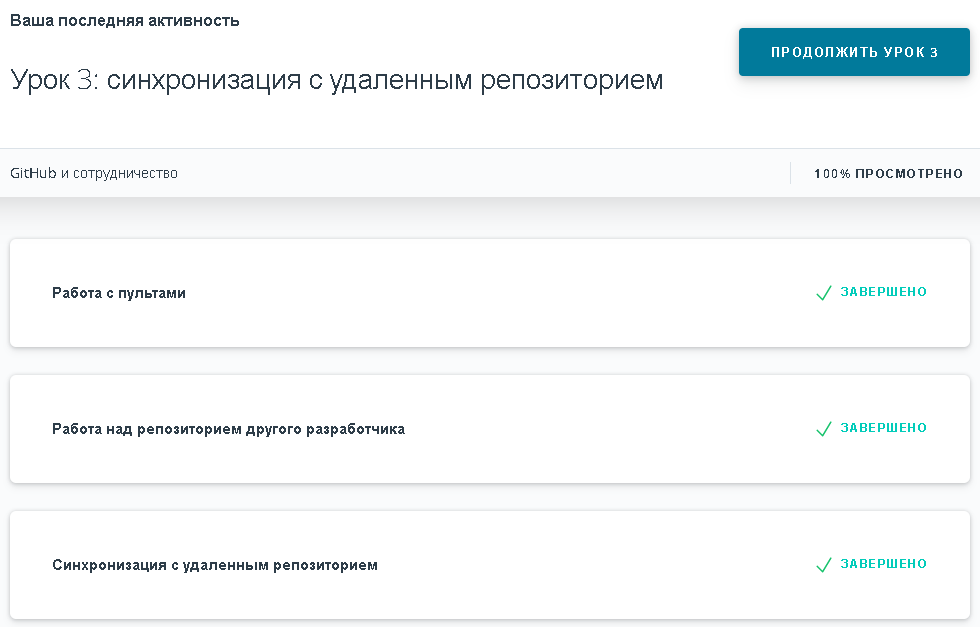
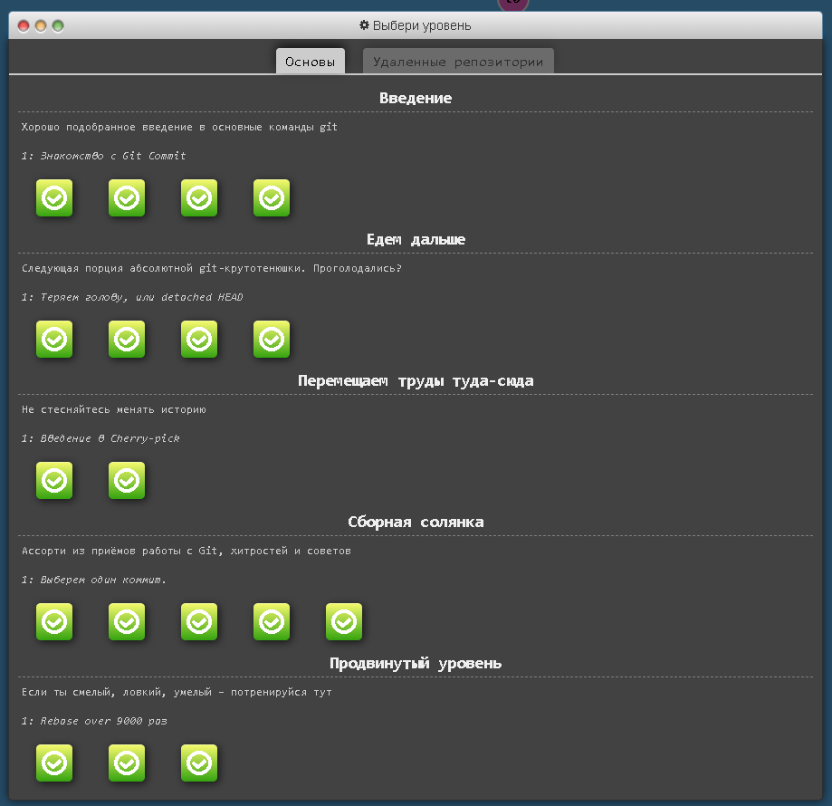
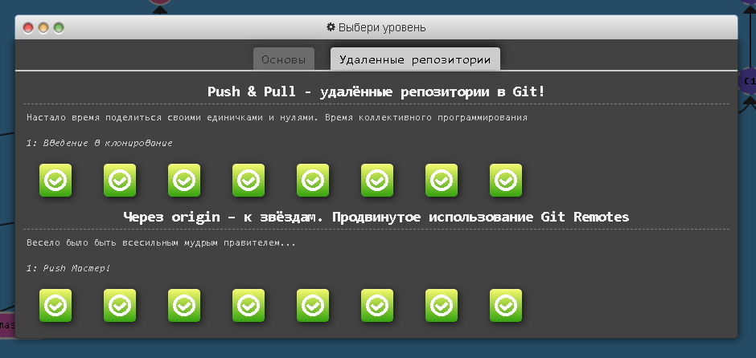
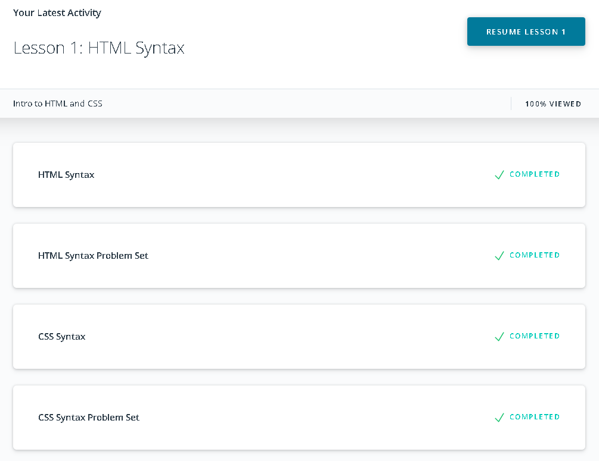
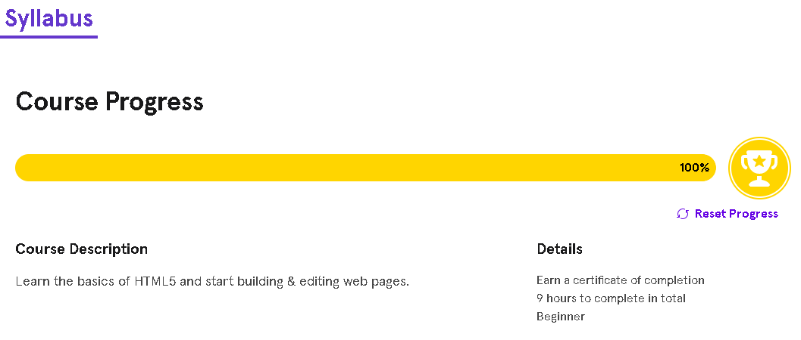
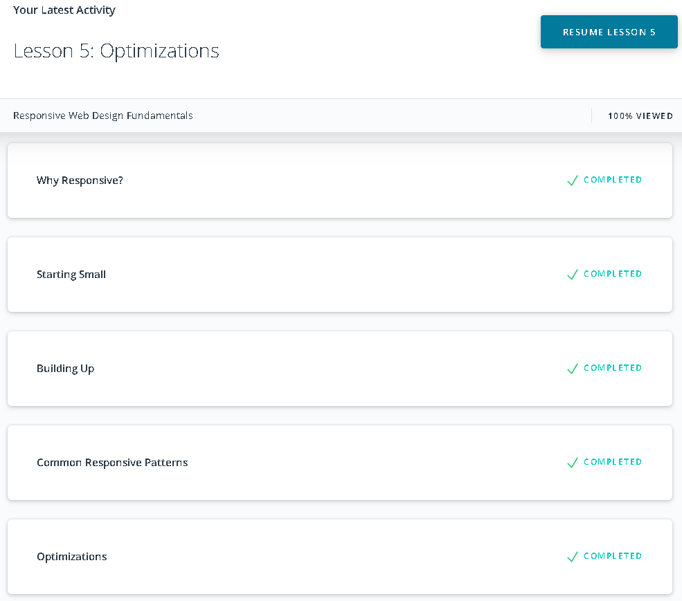
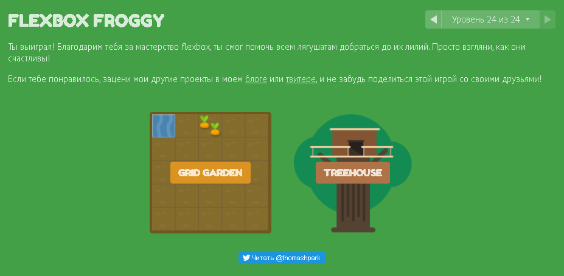

# Learning repository from Kottans

## Linux CLI, and HTTP

Most of the commands were already known. I was already working with the Linux operating system. \
Dealt with options and commands such as chmod, find.
## Git Collaboration

I learned how to make correct pull requests. Dealt with rebase and cherry-pick.
## Intro to HTML and CSS

I have already created web pages so there was not much new.
## Responsive Web Design

I learned how to make a responsive website, use flexbox, and work with responsive units of measure.

